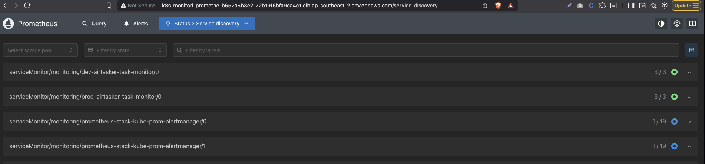
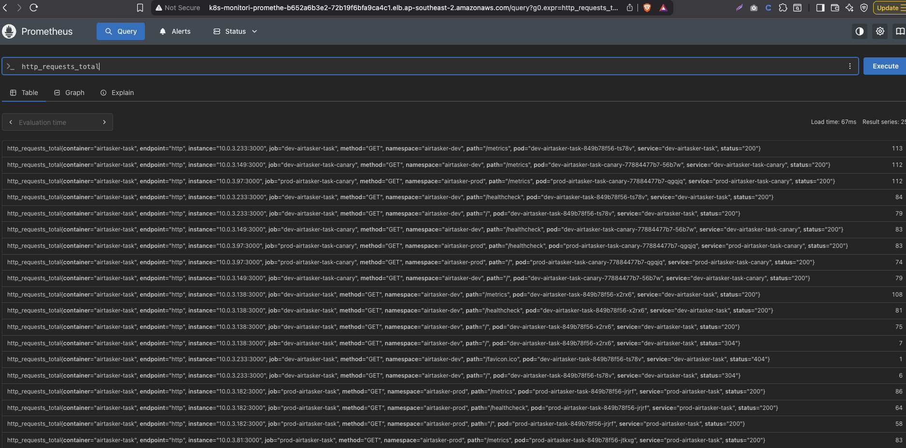
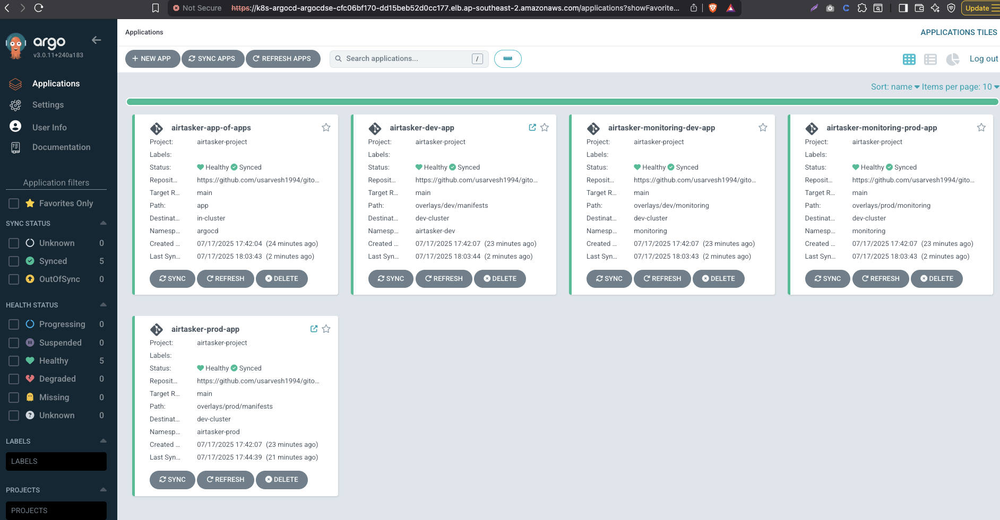

# 🚀 Airtasker GitOps Deployment with Argo CD on AWS EKS

This project demonstrates a complete GitOps workflow for deploying and operating an application in multi-environment AWS EKS clusters using Argo CD, Kustomize, and AWS Load Balancer Controller.

Please refer to  Infra provisioning project where we deploy EKS adn install all requirents with helm from terraform.


we are using the same docker image we created for the task.
---

📁 Git Repository Setup (Important!)
Before Argo CD can sync your applications, you must:

Create a Git repository (private or public, e.g., GitHub).

Push all files from this project (including app, argocd, base, and overlays) into that repo.

Update the AppProject manifest to reference your new repository URL.

🧩 Why This Matters
In argocd/app-project.yaml, there's a field:

 
sourceRepos:
  - https://github.com/usarvesh1994/gitops.git
This value defines which Git repositories Argo CD is allowed to sync from. If you're using your own repository, you must replace this URL with your own repo:


sourceRepos:
  - https://github.com/<your-username>/<your-repo>.git


You mush also create the login secret for access the git repo provided in the eks cluster for argocd to fetch the repo contents if private.
---

## 📦 Features

- ✅ **GitOps** with Argo CD (ApplicationSets, App of Apps, AppProject)
- ✅ **EKS infrastructure** (pre-provisioned via Terraform)
- ✅ **Multi-environment Kustomize** (dev & prod overlays)
- ✅ **Blue/Green  Rollouts** via ALB annotations
- ✅ **AWS Load Balancer Controller** (IngressClass: `alb`)
- ✅ **Horizontal Pod Autoscaler** (HPA) based on CPU utilization
- ✅ **Prometheus Monitoring** via `ServiceMonitor`
- ✅ **Argo CD auto-sync & self-heal enabled**

---

## 📁 Folder Structure


 ```bash
gitops/
├── app/                  # ApplicationSet definitions for Argo CD
│   ├── applicationSet.yaml
├── argocd/               # Argo CD configuration
│   ├── app-of-apps.yaml
│   └── app-project.yaml
├── base/                 # Base Kustomize resources (common to all envs)
│   ├── deployment.yaml
│   ├── deployment-v2.yaml
│   ├── hpa.yaml
│   ├── ingress.yaml
│   ├── service.yaml
│   ├── service-green.yaml
│   └── kustomization.yaml
└── overlays/
    ├── dev/
    │   ├── manifests/
    │   │   ├── ingress-weighted-patch.yaml
    │   │   └── kustomization.yaml
    │   └── monitoring/
    │       ├── kustomization.yaml
    │       └── service-monitor-promotheus.yaml
    └── prod/
        ├── manifests/
        │   ├── ingress-weighted-patch.yaml
        │   └── kustomization.yaml
        └── monitoring/
            ├── kustomization.yaml
            └── service-monitor-promotheus.yaml
  ```

---

## 🧭 Argo CD Setup

### 1. App of Apps

`argocd/app-of-apps.yaml` bootstraps:
- ApplicationSets for app deployments (`app/applicationSet.yaml`)
- Project-scoped config via `app-project.yaml`

### 2. ApplicationSets

Two `ApplicationSets` are defined:

- `airtasker-apps-all-envs`: Deploys app manifests per env (`dev`, `prod`)
- `airtasker-monitoring`: Deploys monitoring stack per env

### 3. AppProject

Defines allowed namespaces (`airtasker-dev`, `airtasker-prod`, `monitoring`) and whitelisted Kinds (e.g., `ServiceMonitor`, `HPA`, `Ingress`, `AppProject`, `ApplicationSet`).

---

## 🌍 Deployment Flow

1. **Provision EKS cluster** with Terraform (done beforehand)
2. **Install Argo CD** into EKS
3. Apply `app-of-apps.yaml` to bootstrap all environments
4. Argo CD watches & syncs the rest from Git

# we need to add the dev-cluster as in the app project as we are using cluster name dev-cluster
   ```bash
  kubectl port-forward svc/argocd-server -n argocd 8080:443
  argocd login localhost:8080 --username admin --password tSf-GfjW5UJu-Sv- --insecure
  argocd cluster add --name dev-cluster $(kubectl config current-context)

  kubectl apply -f argocd/app-project.yaml -n argocd
  kubectl apply -f argocd/app-of-apps.yaml -n argocd
   ```

---

## ⚙️ Application Details

### Blue-Green and Canary Deployment

- Two Deployments: `airtasker-task` and `airtasker-task-canary`
- ALB Ingress with weighted target groups via annotation
- Different weights per environment:
  - Dev: 0/100 split
  - Prod: 90/10 split

Current routing behavior:

✅ Dev Environment: 0% traffic to airtasker-task (Blue), 100% to airtasker-task-canary (Green) - Blue/Green Deployment

✅ Prod Environment: 90% traffic to airtasker-task (Blue), 10% to airtasker-task-canary (Green) - Canary Deployment
 
✅ Purpose: This setup enables full routing to the new canary (green) deployment to validate behavior before rolling back or promoting.


### Horizontal Pod Autoscaler (HPA)
 
minReplicas: 2
maxReplicas: 5
target CPU utilization: 60%
 
 ✅ Step-by-Step: Run CPU Load Inside a Pod

Get the pod name:

```bash
kubectl get pods -n airtasker-dev -l app=airtasker-task
Output will be something like:
airtasker-task-5cbd77f6df-wxyz

Exec into the pod:

kubectl exec -n airtasker-dev -it <POD_NAME> -- /bin/sh

Example:

kubectl exec -n airtasker-dev -it airtasker-task-5cbd77f6df-wxyz -- /bin/sh

Run a CPU load loop:

Inside the pod shell, run:

while true; do :; done
   ```

This loop will keep the CPU busy by running a no-op command continuously (: is a shell builtin that does nothing).

✅ Monitor HPA:
While the loop runs, in a new terminal tab, watch the HPA scale up:

```bash
kubectl get hpa -n airtasker-dev -w
   ```

🔁 Exit + Clean Up
Press Ctrl+C to stop watching HPA.

Exit the pod shell with:

exit

Let me know if your container uses alpine or another shell — I’ll adjust the loop accordingly.

### Prometheus Monitoring

`ServiceMonitor` exposes `/metrics` endpoint via label `name: airtasker-task` in:
- `airtasker-dev` namespace
- `airtasker-prod` namespace




---

## ✅ Deploy / Test

To trigger the full sync via Argo CD (after `app-of-apps.yaml` is applied), either:

- Use Argo CD UI
- Use CLI: `argocd app sync airtasker-dev-app`




Test using the ALB DNS provisioned by the AWS.
---

## 🧹 Cleanup

```bash
kubectl delete -f argocd/app-project.yaml -n argocd
kubectl delete -f argocd/app-of-apps.yaml -n argocd
  ```
---

## 📌 Notes

- This setup uses GitOps best practices and fully automates multi-env deployments.
- Cluster already includes AWS Load Balancer Controller, Prometheus Operator, and Argo CD.
- Image repo: ` usarvesh/airtasker`

